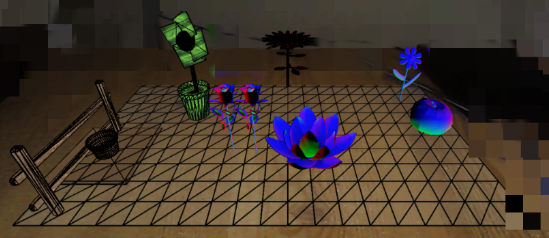

# Project status  

This project is **deprecated**. Some source files were deleted. The purpose of the project was to experiment [Three.js](https://threejs.org/) and use it to mimic augmented reality effects. The core functionality can be found in `./src/js/draw.js`. 

## Garden Planner Web App

   

> #Garden planner #3D Plants #Three.js
> 
A garden planner uses 3D plant models and a device camera to help users visualise and plan the garden layout.

#### Screenshot

 

## Features

* :camera: With the help of a device camera, users can drag and drop 3D plant models onto canvas to visualise the layout. 
* :seedling: The calendar page shows suggested seeding dates for plants.

## Tech Stack 

- Frontend Framework: [Materialize](https://materializecss.com/)
- Backend framework: [Express](https://expressjs.com/)
- Database: [MongoDB](https://www.mongodb.com/)
- Language: [ES6](https://github.com/lukehoban/es6features#readme), [EJS](https://ejs.co/), [CSS3](https://www.w3.org/TR/2001/WD-css3-roadmap-20010523/)
- Bundler: [Webpack](https://webpack.js.org/)

## Tools Used

|                          **Source**                          |           **Used on**           |
| :----------------------------------------------------------: | :-----------------------------: |
|      [Flickr API](https://www.flickr.com/services/api/)      |          Plant images           |
| [Merriam-Webster Dictionary API](https://dictionaryapi.com/) |       Plant descriptions        |
|                [JQuery](https://jquery.com/)                 |                -                |
|               [Three.js](https://threejs.org/)               | Canvas and manipulate 3D models |
|    [dhtmlxscheduler](https://docs.dhtmlx.com/scheduler/)     |        Calendar feature         |
|        [Dat.GUI](https://github.com/dataarts/dat.gui)        |      Control of 3D models       |
| [Pexel API](https://www.pexels.com/api/), [Unsplash](https://unsplash.com/) |        Background images        |

## License

This project is licensed under the terms of the **[MIT](https://choosealicense.com/licenses/mit/)** license.

